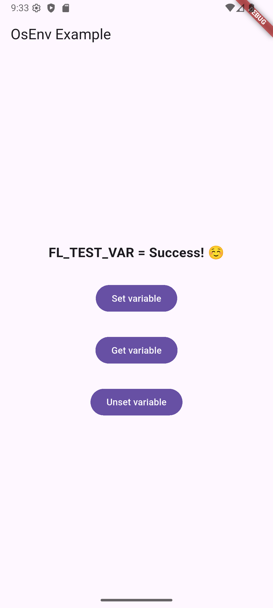

# osenv

Get and set environment variables via native code.


## Introduction

Flutter gives the programmers a convenient way to access environment variables of the current process (application): the `Platform.environment` map. However, it only allows you to read the values of the variables. Even if you change a value associated with a particular variable name, the change is not propagated back to the environment - it is only visible in the `Platform.environment` map. While that may be sufficient for pure Dart/Flutter application, it is not enough if your project uses native libraries, which try to get the data from environment variables. Native code will read the variables directly from the operating system, so to have them see the modified values, the modifications need to be done via native OS functions (at least until that functionality is provided by Flutter itself, in which case this plugin will become obsolete).

> This is the main use case of the *osenv* plugin: you load some native libraries and call native functions via FFI, but the native code expects some additional information to be passed in the environment variables, and you need to set those variables in your Flutter code before calling native code.

The plugin currently works on Android, Windows and Linux. The code *should* work also on MacOS, but it was not tested on that platform (as well as on iOS), due to the author's lack of access to Apple hardware (and reluctance to get one ;) ), so MacOS and iOS can't be responsibly listed as supported platforms at the moment.

The plugin calls platform-specific functions via FFI:

* on Android and Linux, the POSIX-compliant functions [setenv](https://www.man7.org/linux/man-pages/man3/setenv.3.html), [getenv](https://www.man7.org/linux/man-pages/man3/getenv.3.html) and [unsetenv](https://www.man7.org/linux/man-pages/man3/unsetenv.3p.html) are used,

* on Windows, the WINAPI [GetEnvironmentVariable](https://learn.microsoft.com/en-us/windows/win32/api/winbase/nf-winbase-getenvironmentvariable) and [SetEnvironmentVariable](https://learn.microsoft.com/en-us/windows/win32/api/winbase/nf-winbase-setenvironmentvariable) are called.

## A quick example

A code snippet illustrating the use of the plugin:
```dart
import 'package:osenv/osenv.dart' as osenv;

osenv.setEnv('MY_TEST_VAR', 'my test value');
varValue = osenv.getEnv(varName);
if (varValue != null) {
  debugPrint('MY_TEST_VAR = $varValue');
} else {
  debugPrint('MY_TEST_VAR is not set');
}
osenv.unsetEnv('MY_TEST_VAR');

```

For a full working Flutter code, take a look at the [example project](https://github.com/hipercompl/osenv/tree/main/example) in the plugin repository.



## Usage

1. Add the plugin as a dependency:
    ```bash
    flutter pub add osenv
    ```

2. In your code, add the appropriate import:
    ```dart
    import 'package:osenv/osenv.dart' as osenv;
    ```

3. From now on, you can call functions published by the plugin:

* `String? getEnv(String name)` - get the value of the environment variable `name` (returns `null` if the variable is not set),

* `bool setEnv(String name, String value)` - set / change the value of the variable `name`,

* `bool unsetEnv(String name)` - remove the variable `name` from the environment of the current process.

That's it - the plugin only publishes those three functions. All calls are synchronous (no need to `await` them).

## Building projects
Please keep in mind, that this is a **ffi plugin**, i.e. it includes native code, compiled to a native dynamic library. Depending on the target platform of the project using the plugin, it may be necessary to install native build tools for the platform (e.g. Android NDK, CMake). Flutter CLI takes care of this, but if you use a non-standard build workflow, it may require some adjustments to include native code.

## Roadmap

Perhaps with the help from the community, tests on MacOS / iOS can be done and those platforms may get included as officially supported.
